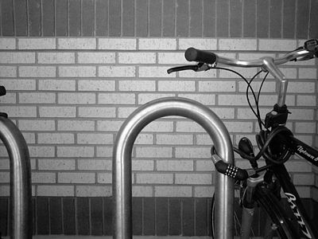
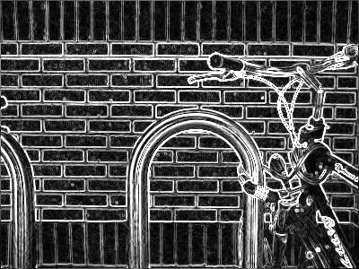

# Simple Image Processing in Rust

## Features
 - Grayscale
 - Reflect<sup>1</sup>
 - Blur
 - Edge Detection<sup>2</sup>

<sup>1</sup> Reflects the image horizontally

<sup>2</sup> Uses a sobel operator on all 3 channels for grayscale and color edge detection

## Building and Running
### Usage
```
Usage: image-processing --path <PATH> --output-path <OUTPUT_PATH> <COMMAND>

Commands:
  gray-scale  Averages rgb values of each pixel
  reflect     Reflects the image horizontally
  blur        Sets rgb values to the average of the pixels around it
  edges       Aplies the sobel operator
  help        Print this message or the help of the given subcommand(s)

Options:
  -p, --path <PATH>                
  -o, --output-path <OUTPUT_PATH>  
  -h, --help                       Print help
```
### Building
`$ cargo build --release`
### Running
`$ ./target/release/image-processing -p PATH -o OUTPUT_PATH COMMAND`
or
`$ cargo run -- -p PATH -o OUTPUT_PATH COMMAND`

## Edge Detection Showcase
| Before | After |
| ----------- | ----------- |
|  |  |
|  |  |
